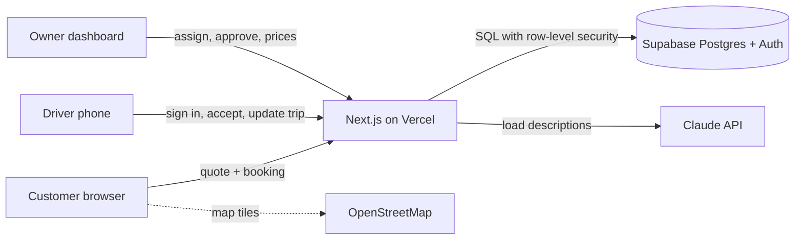

# Architecture

## Overview



One Next.js project serves all three audiences. Supabase holds the data and handles sign-in. Its row-level security rules decide who can read or change what, so the rules hold even if a page has a bug.

## Data model

| Table | Holds |
|---|---|
| `profiles` | Every signed-in person, with role `customer`, `driver` or `admin` |
| `drivers` | Driver details: approval status, plate, licence, online switch, current area, rating |
| `pricing_zones`, `pricing_areas`, `pricing_load_types`, `pricing_settings` | The price list the owner edits |
| `bookings` | Each job: trip, load, the quote lines and total, status, assigned driver |
| `booking_events` | A timeline row for every status change, with who made it |
| `ai_load_requests` | What customers asked the AI load assistant, for the owner to learn from |

Booking status moves in one direction only:
`requested → assigned → driver_en_route → arrived_pickup → in_transit → delivered` (or `cancelled`).

## Security rules that matter

- **Prices can't be forged.** The booking API recalculates the quote from the database price list and ignores any price sent from the browser.
- **Drivers change jobs only through database functions** (`accept_booking`, `advance_booking`, `set_driver_online`, `set_driver_area`). A driver can't take a job someone else accepted, skip a step, or approve themselves.
- **Customer privacy.** Open jobs show drivers only the areas, load and pay (`list_open_jobs`). Name, phone and street address appear after the driver accepts.
- **Admin is set by hand.** Nobody can sign up as admin; the owner is promoted with one SQL line.
- **The service key stays on the server.** Only server code uses `SUPABASE_SERVICE_ROLE_KEY`.

## Pricing engine

`src/lib/pricing.ts`

```
total = fare(farthest zone) × load multiplier
      + helpers × helper fee
      + (floors at pickup + floors at drop-off) × stairs fee
      + pickup zone fare × out-of-hub share   (only when pickup is outside Ikorodu)
driver earning = total × driver share
```

The farthest zone sets the fare because the truck always returns to the Ikorodu hub.

## Smart matching

`src/lib/matching.ts` ranks free drivers for each job and returns reasons in plain words ("very close (2.1 km), online now, top rated 4.9★"). The score:

- starts at 100
- −2 per km between the driver's current area and the pickup (road distance estimated as straight line × 1.4)
- +25 if online
- ±8 per rating star above or below 4
- −4 per trip the driver already did today, so work is shared

Drivers already on a job are excluded. The owner sees the best match on every open job and can assign with one tap, or pick someone else from the ranked list.

## AI load assistant

`src/app/api/ai/load/route.ts`

The customer describes their load in their own words. Claude (model `claude-opus-5`, low effort for speed) returns a structured answer that is checked against a fixed schema:

| Field | Meaning |
|---|---|
| `loadType` | small, household, furniture or full |
| `helpers` | 0–4 loading helpers |
| `tripsNeeded` | how many Suzuki Carry trips the load takes |
| `summary` | one or two friendly sentences |
| `tips` | up to three packing or safety tips |

The form fills in the load size and helpers, and the customer can still change them. The AI never sets the price; the pricing engine does. Requests are limited per visitor to protect costs. If the assistant is off or unavailable, booking works exactly the same without it.

## Maps

`src/components/TripMap.tsx` uses Leaflet with free OpenStreetMap tiles to show pickup, drop-off and the Ikorodu hub. Area centre points live in `src/lib/geo.ts`. As traffic grows, switch tiles to a paid provider (for example Mapbox or Google Maps), because OpenStreetMap's free tiles are meant for light use. Street-level addresses and live GPS come in Phase 2.
